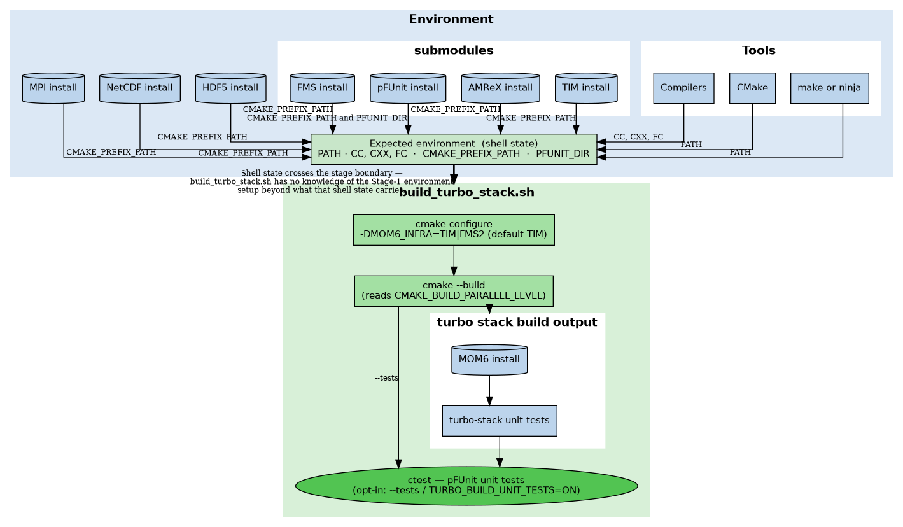
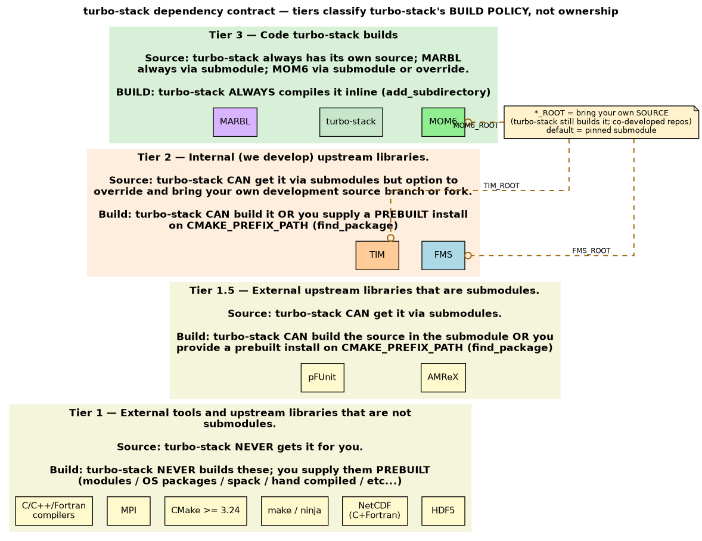
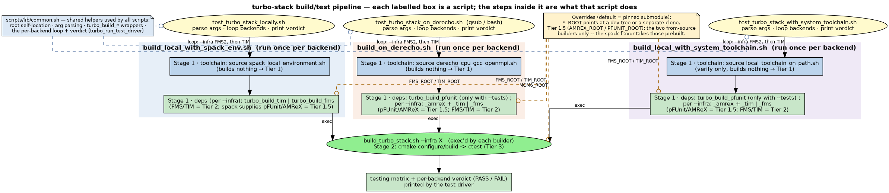

[](https://github.com/TURBO-ESM/turbo-stack/actions/workflows/turbo-cmake-container-tests.yaml)
[](https://github.com/TURBO-ESM/turbo-stack/actions/workflows/build-tests.yaml)

# TURBO Stack

Welcome to the *TURBO Stack* repository, the central software hub for the TURBO project.
This repository brings together various components that make up the TURBO Stack, including:

 - [MOM6](https://github.com/TURBO-ESM/MOM6)
 - [TIM](https://github.com/TURBO-ESM/TIM) 
 - [FMS](https://github.com/TURBO-ESM/FMS)
 - [MARBL](https://github.com/marbl-ecosys/MARBL)
 - development and testing utilities
 - and future libraries and components that will be developed as part of the TURBO project.

> [!IMPORTANT]
> **There are two build systems.** This README documents the **CMake** build
> system, which is where new work should go. The original mkmf `build.sh` build
> still works and is still exercised in CI; it is documented in
> [`docs/legacy_build_system.md`](docs/legacy_build_system.md).

## Getting the code

Clone the repository along with all submodules:

```bash
git clone --recursive https://github.com/TURBO-ESM/turbo-stack.git
```

If you already cloned this repo but forgot the `--recursive` you can get the submodules at anytime with:
```bash
git submodule update --init --recursive
````
## Quickstart on Derecho

### One liner to build and test both backends (TIM and FMS2) in a batch job. 
```bash
git clone --recursive https://github.com/TURBO-ESM/turbo-stack.git
cd turbo-stack
qsub test_turbo_stack_on_derecho.sh
```
That driver is a true one liner: it carries its own PBS directives (turbo
project code, one node, 128 cores, one hour), then for each backend in turn —
TIM and FMS2 — loads Derecho's module toolchain, builds the dependencies from
the pinned submodules, builds MOM6, and runs the pFUnit suite. Each backend gets
its own process and its own build directory, and the run ends with a PASS / FAIL
verdict for each.

It is deliberately self-contained: with no `#PBS -V`, nothing from your login
shell reaches the job, so what gets tested is exactly what the repo pins. It
writes nothing into your checkout, and the job log lands in
`turbo-stack-on-derecho-test.o<jobid>` in the directory you submitted from, with
a per-backend log alongside the builds.

**Change the run options:** Adding a `qsub` option to the command line overrides the matching directive in the script — e.g. to run under a different project code for 30 minutes:

```bash
qsub -A <project_code> -l walltime=00:30:00 test_turbo_stack_on_derecho.sh
```

**Change where the build artifacts are written:** Each backend is built and tested in its own directory under `$TURBO_BUILD_SYSTEM_TEST_DIR` (default: `$TMPDIR/turbo_build_system_test`, or `/tmp` if `TMPDIR` is unset), so the two executables land at `<that dir>/turbo-stack-with-{TIM,FMS2}/mom6_build/config_src/drivers/solo_driver/MOM6`. If you want them somewhere else, set that variable. Unlike the job scripts in `examples/`, this driver does **not** repoint `TMPDIR` at scratch, and with no `#PBS -V` it will not inherit one you exported before submitting — so pass an explicit path for anything you want to keep:

```bash
qsub -v TURBO_BUILD_SYSTEM_TEST_DIR=/glade/derecho/scratch/$USER/turbo-test \
     test_turbo_stack_on_derecho.sh
```

### Build on Derecho yourself:
All prerequisites to build turbo-stack are already available on Derecho as Lmod modules, and `build_on_derecho.sh` loads them for you, so a fresh clone to a built is:

```bash
git clone --recursive https://github.com/TURBO-ESM/turbo-stack.git
cd turbo-stack
qcmd -A <project_code> -- ./scripts/build_on_derecho.sh --tests
```

`qcmd` puts the compile on a compute node — drop it if you are already inside an interactive job. `--tests` is optional, it builds and runs the pFUnit test suite. The default location the MOM6 executable ends up at:

```
build/default/mom6_build/config_src/drivers/solo_driver/MOM6
```

The `build_on_derecho.sh` script contains a number of useful options; see them all with `-h` or `--help`. Some commonly used ones are `--infra FMS2` for the FMS2 backend (defaults to TIM), and `--clean` to rebuild everything from scratch.

> [NOTE]
> These Derecho scripts run `module purge` before loading their own set of modules. So any modules you loaded yourself are discarded. 

## Overview of software stack
turbo-stack holds unit tests for the infrastructure layer backends, TIM and FMS2. They are **linked** against MOM6 rather than run through it: every test links `TURBO::infra_r8` (the backend itself) plus the MOM6 library under test — usually `MOM6::infra`, which is MOM6's own wrapper over the backend, sometimes `MOM6::framework`. So MOM6's libraries have to be built, but the MOM6 executable is never involved. Building and running those tests is this repository's main job, alongside producing a standalone MOM6 executable. The real work gets done in [`scripts/build_turbo_stack.sh`](scripts/build_turbo_stack.sh), but a number of things (compilers, tools, libraries...) have to be set up before that script can run.
[](docs/two_stage_pipeline.png)

So we split this into a two phase process.
 1. **Set up the environment** — put the toolchain on `PATH` and make every dependency turbo-stack does not compile itself discoverable (tiers 1, 1.5 and 2 below).
 2. **Build turbo-stack** — `build_turbo_stack.sh` runs `cmake` configure and build against that prepared environment, compiling tier 3 (turbo-stack's tests, MOM6, MARBL). Given `--tests` it then runs the suite under `ctest`.

Setting up the environment, phase 1, varies from machine to machine. While phase 2 is the same across all machines, essentially just calling build_turbo_stack.sh.

There are some scripts in this repository to automate the entire process (phase 1 and 2) on specific machines ([Derecho](#quickstart-on-derecho)) or with specific tools ([Spack](scripts/README.md#one-command-spack-flavor)). Most of the work in those scripts has to do with setting up the environment, phase 1.

To help describe what we mean by the environment a dependency diagram of the turbo-stack software stack is shown below. The diagram is incomplete but shows the major pieces. You will also need a few more things: bash, common unix / linux command line tools that are called in our bash scripts, git, etc.

[](docs/dependency_tiers.png)

For comparison with the previous figure we consider everything in tiers 1, 1.5, and 2 as needing to be set up prior to calling build_turbo_stack.sh, which essentially builds everything in tier 3.

The sections below cover what you have to supply and how. The full policy — which
tier turbo-stack never builds, optionally builds, and always builds, and who the
members are — is the dependency contract in
[`scripts/README.md`](scripts/README.md#dependency-contract-tiers).

### Tier 1 — Prerequisites (no source supplied via submodules)

turbo-stack does not supply the source code of these as submodules and will not build them for you. You are expected to supply them in the environment. You can build them from source but these are typically available via a package manager, e.g. Lmod modules on HPC systems, Spack, Homebrew on macOS, apt-get on Debian, etc. None of these scripts accept `cmake -D…` options, so each requirement below is picked up from the environment instead:

| Requirement | Sufficient to set | Notes |
|---|---|---|
| Fortran compiler | `FC`, else CMake tries to find it by searching `PATH` | GNU, Intel / IntelLLVM, NVHPC / PGI, or Flang / LLVMFlang. Any other compiler ID is a hard configure error — `cmake/TurboCompilerFlags.cmake` carries no flag set for it |
| C and C++ compilers | `CC` and `CXX`, else CMake tries to find them by searching `PATH` | the top-level project enables `C CXX`, so both C and C++ compilers are needed |
| MPI | `mpicc`, `mpifort` (or `mpif90`) and `mpicxx` (or `mpic++`) on `PATH`, or `MPI_HOME` | the Fortran and C wrappers; the TIM/AMReX path uses the C++ one too |
| NetCDF | `nc-config` / `nf-config` on `PATH`, or `NetCDF_ROOT`, or the install prefix on `CMAKE_PREFIX_PATH` | need the C and Fortran libraries |
| CMake | on `PATH` | ≥ 3.24 — turbo-stack, MOM6, TIM and pFUnit each require it |
| `make` or `ninja` | on `PATH` | Unix Makefiles by default, running the build scripts with `--ninja` picks Ninja instead |

Compiler flags are the same story: CMake seeds them from `FFLAGS` / `CFLAGS` /
`CXXFLAGS` natively and appends the project's own, so there is no script flag for
them.

> [!IMPORTANT]
> `CC`, `CXX`, `FC` and the `*FLAGS` are read **only on the first configure** of
> a build directory — CMake caches them. To change compiler or flags in a build
> directory you have already configured, rebuild with `--clean`.

> We do provide ways to get these via a Spack environment (below). And via a container image (coming soon!).

### Tier 1.5 — Prerequisites, but we supply the source via a submodule

AMReX and pFUnit are external libraries. The source code is provided via submodules. However you can bring your own install by adding its install prefix on `CMAKE_PREFIX_PATH`. pFUnit needs one extra step: it installs into a versioned `PFUNIT-X.Y/` subdirectory that `find_package` will not find by default, so point `PFUNIT_DIR` at `<prefix>/PFUNIT-X.Y/cmake`.

#### Getting tiers 1 and 1.5 from Spack

[`spack/spack.yaml`](spack/spack.yaml) supplies CMake, `make`/`ninja`, MPI,
NetCDF, ParallelIO, pFUnit and AMReX — everything in tier 1 except a base
compiler, plus both of tier 1.5. So all you need is a compiler and `SPACK_ROOT`
pointing at a [Spack](https://github.com/spack/spack) clone. If you already
source Spack's `share/spack/setup-env.sh` (from your shell profile, say), it
exports `SPACK_ROOT` for you and there is nothing to set. Otherwise export it by
hand — the build script sources `setup-env.sh` itself, so you do not have to:

```bash
export SPACK_ROOT=~/spack
```

The `turbo_stack` environment is created on first use by
[`scripts/build_local_with_spack_env.sh`](scripts/build_local_with_spack_env.sh).

### Tier 2 — Infrastructure backend
FMS and TIM are the two backends MOM6's infrastructure layer sits on, and the two
we co-develop: TIM is TURBO's own AMReX-based layer, while FMS is GFDL's Flexible
Modeling System tracked in a [TURBO-ESM fork](https://github.com/TURBO-ESM/FMS).
turbo-stack supplies both as submodules and builds whichever one `--infra`
selects. To supply one yourself instead, put its install prefix on
`CMAKE_PREFIX_PATH`.

> [!NOTE]
> `FMS_ROOT`, `TIM_ROOT`, `AMREX_ROOT` and `PFUNIT_ROOT` are **not** install
> prefixes — each names a *source tree* for turbo-stack to build. See
> [Building against a development tree or a branch](#building-against-a-development-tree-or-a-branch).

### Tier 3 — What turbo-stack always builds

turbo-stack, MOM6 and MARBL are compiled inline on every build, pulled in with
`add_subdirectory` from the top-level [`CMakeLists.txt`](CMakeLists.txt). This is
the tier phase 2 exists to build. Unlike tiers 1.5 and 2 there is no
bring-your-own-install option — nothing goes looking for a prebuilt MOM6 or
MARBL, so here only the *source* can be swapped.

- **MOM6** is read from `MOM6_ROOT`, the one source override the build cannot do
  without: CMake hard-errors when it is unset, so the build scripts default it to
  `submodules/MOM6` for you. Point it elsewhere to build a fork or a branch.
- **MARBL** comes from `submodules/MARBL` only — it has no `*_ROOT` override.
- **turbo-stack** itself is whichever checkout you ran the scripts from, which is
  also where the pFUnit suite in [`tests/`](tests/) lives. The suite is opt-in, so
  it is only configured when you pass `--tests`.

## Testing both backends end to end

There are high level drivers at the repo root that build **and** `ctest` both backends (TIM and FMS2), each in its own build directory, and print a per-backend matrix and PASS/FAIL verdict. They write nothing into your checkout — artifacts go under
`$TURBO_BUILD_SYSTEM_TEST_DIR` (default `${TMPDIR:-/tmp}/turbo_build_system_test`):

```bash
./test_turbo_stack_locally.sh                   # Spack toolchain
./test_turbo_stack_with_system_toolchain.sh     # your own toolchain on PATH
./test_turbo_stack_on_derecho.sh                # Derecho (qsub or interactive)
```

`--only FMS2|TIM` narrows to one backend; `--clean` wipes that artifact
directory first, for a genuine from-scratch run; `--parallel N` sets the job
count. The matrix reports the commit and branch of
turbo-stack, MOM6, TIM and FMS, and whether each came from its pinned submodule
or from an override — so a log says exactly what was tested.

## Build with a specific backend yourself — pick the recipe for your machine

Each of these is one command that takes you from a fresh clone to a MOM6
executable: it prepares the environment, builds the dependencies your
environment did not supply, then configures and builds turbo-stack.

| Your machine | Command |
|---|---|
| Laptop / workstation, let Spack manage the toolchain | `scripts/build_local_with_spack_env.sh` |
| Laptop / workstation, toolchain already on `PATH` | `scripts/build_local_with_system_toolchain.sh` |
| Derecho (NCAR), Lmod modules | `scripts/build_on_derecho.sh` |

They take the same options:

```bash
scripts/build_local_with_spack_env.sh                 # default: TIM backend, Release
scripts/build_local_with_spack_env.sh --tests         # also build + run the pFUnit unit tests
scripts/build_local_with_spack_env.sh --infra FMS2    # FMS2 backend instead of TIM
scripts/build_local_with_spack_env.sh --debug         # Debug build
scripts/build_local_with_spack_env.sh --clean         # rebuild from scratch (dependencies included)
scripts/build_local_with_spack_env.sh --parallel 16   # 16 parallel build jobs
scripts/build_local_with_spack_env.sh --ninja         # Ninja instead of Unix Makefiles
scripts/build_local_with_spack_env.sh --build_dir DIR # build somewhere other than build/default
```

`--help` on any of them prints the authoritative list. On Derecho, prepend
`qcmd -A <project_code> --` as in the [quickstart](#quickstart-on-derecho).

[](docs/build_test_orchestration.png)

*What each of those scripts does (click to enlarge). The three builders differ only in how the
environment is prepared; everything from `build_turbo_stack.sh` down is identical.*

## Infrastructure backends

MOM6 is built against exactly one infrastructure layer, chosen with `--infra`:

- **`TIM`** — Turbo Infrastructure for MOM, backed by AMReX. **The default.**
- **`FMS2`** — the traditional Flexible Modeling System layer; the reference backend.

The two are mutually exclusive, and the choice decides which dependency gets
built: `--infra TIM` builds TIM, `--infra FMS2` builds FMS. Switching backends
in an existing build directory is safe — the flag is always passed to CMake
explicitly, so a previous choice never sticks in the cache.

## Where the build lands

With no `--build_dir`, a build from the repo root produces:

| Path | Contents |
|---|---|
| `build/default/` | turbo-stack's CMake build tree |
| `build/default/mom6_build/config_src/drivers/solo_driver/MOM6` | the standalone MOM6 executable |
| `deps/default/build/`, `deps/default/install/` | the dependencies built from `submodules/` |

Passing `--build_dir DIR` moves both: the build tree to `DIR` and the
dependencies to `DIR/deps/{build,install}/`. Both locations are outside `bin/`,
so a CMake build and a legacy mkmf build can coexist.

## Unit tests

The [pFUnit](https://github.com/Goddard-Fortran-Ecosystem/pFUnit) suite in [`tests/`](tests/) is **opt-in**. Add `--tests` to build the test suite and run it under `ctest`:

```bash
scripts/build_local_with_spack_env.sh --tests
```

The tests are MPI-aware — each declares the PE counts it runs on, e.g. `@test(npes=[4])`. They cover MOM6's infrastructure interface layer against whichever backend you built, not MOM6's ocean code itself. To re-run them without rebuilding:

```bash
ctest --test-dir build/default
```

See [`tests/README.md`](tests/README.md) for how to add one.

## Building against a development tree or a branch

To build a co-developed component from somewhere other than its pinned
submodule, export its `*_ROOT` before building. No flag, no cloning by the build
scripts:

```bash
export MOM6_ROOT=$PATH_TO_YOUR_OWN/MOM6
export TIM_ROOT=$PATH_TO_YOUR_OWN/TIM
export FMS_ROOT=$PATH_TO_YOUR_OWN/FMS

# Now this overrides the submodules and uses your own copy MOM6, TIM, and FMS at the provided paths
./test_turbo_stack_locally.sh
```

`MOM6_ROOT`, `FMS_ROOT` and `TIM_ROOT` are the co-developed ones, and the
testing matrix reports each as `(override)` or `(submodule)` so a log says what
was built. `AMREX_ROOT` and `PFUNIT_ROOT` work the same way but go unreported.
To build a *branch* you do not have checked out, either move the submodule onto it or clone it yourself and point `*_ROOT` there — both recipes are in [`scripts/README.md`](scripts/README.md#building-a-mom6-branch-you-dont-have-checked-out).

## Running example experiments

[`examples/`](examples/) holds ready-to-run standalone MOM6 configurations
(`double_gyre`, `benchmark`, CESM grids, …). Run the executable from inside the
example directory so it picks up that experiment's `MOM_input`, `input.nml` and
`diag_table`:

```bash
cd examples/double_gyre/
../../build/default/mom6_build/config_src/drivers/solo_driver/MOM6
```

For computationally more expensive examples, such as `benchmark`, run MOM6 in
parallel:

```bash
mpirun ../../build/default/mom6_build/config_src/drivers/solo_driver/MOM6
```

Example job submission scripts are provided in all of the example directories.
Make sure to adjust the project code and the path to the executable you built.

Once the run is complete, the model output files will be in the example
directory. To *archive* them:

```bash
make archive
```

This will create a copy of the output files in the `archive/` directory, with a
timestamp indicating when the archive was created. To clean up an example
directory, i.e., to remove all untracked output files (except the archive):

```bash
make clean
```

## Continuous integration

CI covers both build systems in separate lanes and separate containers:

| Lane | Workflows | Build system |
|---|---|---|
| CMake | `turbo-cmake-container-tests.yaml` (via the reusable `cmake-build.yaml`) | `scripts/build_local_with_spack_env.sh` in the prebuilt `turbo-ci` image |
| legacy | `build-tests.yaml`, `build-tests-iturbo.yaml`, `unit-tests.yaml`, `matrix-compiler-smoketest.yaml`, `code-coverage-reports.yaml` | `./build.sh` in the NCAR CISL dev containers |

The CMake lane runs four cells: the pinned MOM6 submodule and the tip of MOM6's
`dev/turbo-debug` branch, each against both backends. Refreshing the CI image
after a `spack/spack.yaml` change is a manual step — see
[`docker/README.md`](docker/README.md).

## Going further

| Document | What it covers |
|---|---|
| [`scripts/README.md`](scripts/README.md) | **The full build-system reference** — dependency tiers, the two-stage pipeline, `build_dep`, source overrides, parallelism, every environment variable |
| [`docs/legacy_build_system.md`](docs/legacy_build_system.md) | The original mkmf `build.sh` build system |
| [`tests/README.md`](tests/README.md) | Writing and adding pFUnit unit tests |
| [`docker/README.md`](docker/README.md) | The CI container image and the workflows that build and consume it |
| [`examples/README.md`](examples/README.md) | Running and archiving the example experiments |
| `docs/*.dot` | The figure above and its siblings. Regenerate a PNG with `dot -Tpng -o docs/<name>.png docs/<name>.dot`; the matching `*_prompt.md` documents what each figure must show |
