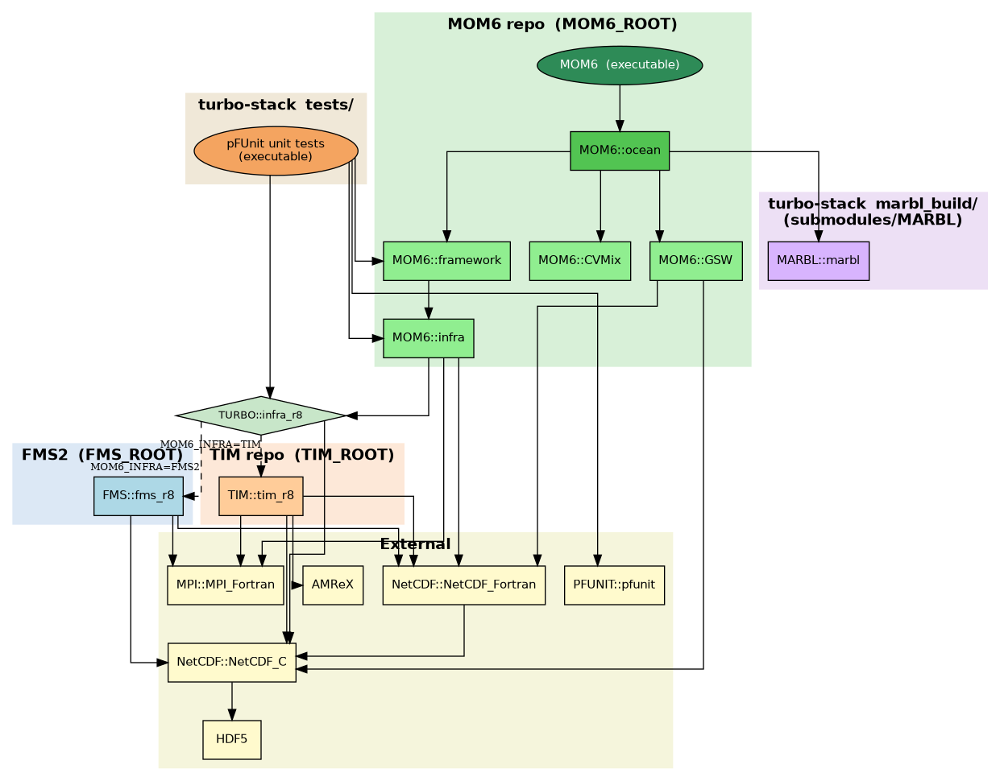
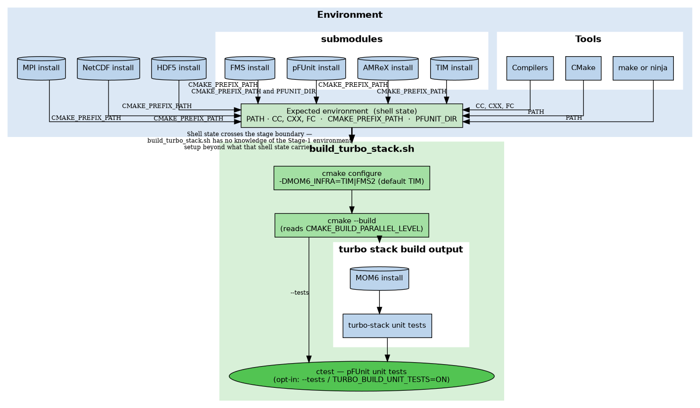
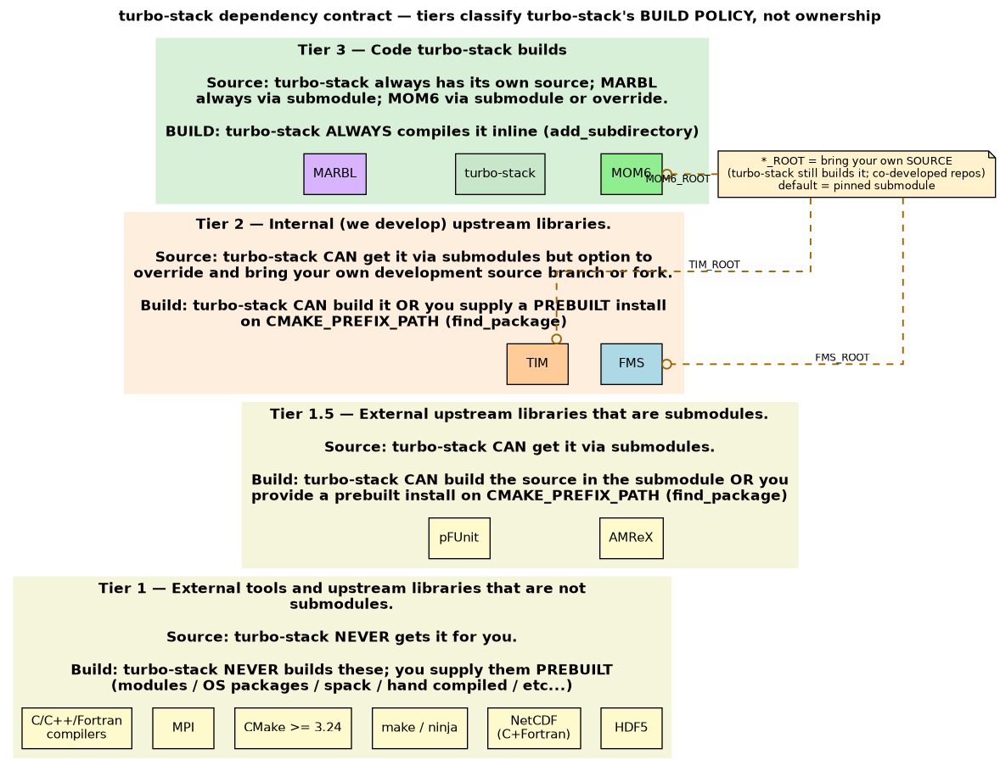

[](https://github.com/TURBO-ESM/turbo-stack/actions/workflows/turbo-cmake-container-tests.yaml)
[](https://github.com/TURBO-ESM/turbo-stack/actions/workflows/build-tests.yaml)

# TURBO Stack

Welcome to the *TURBO Stack* repository, the central software hub for the TURBO project.
This repository brings together various components that make up the TURBO Stack, including:

 - [MOM6](https://github.com/TURBO-ESM/MOM6)
 - [TIM](https://github.com/TURBO-ESM/TIM) 
 - [FMS](https://github.com/TURBO-ESM/FMS)
 - [MARBL](https://github.com/marbl-ecosys/MARBL)
 - development and testing utilities
 - and future libraries and components that will be developed as part of the TURBO project.

> **There are two build systems.** This README documents the **CMake** build system, which is where new work should go. The original mkmf `build.sh` build still works and is still exercised in CI; it is documented in [`docs/legacy_build_system.md`](docs/legacy_build_system.md).

## Getting the code

Clone the repository along with all submodules:

```bash
git clone --recursive https://github.com/TURBO-ESM/turbo-stack.git
```

If you already cloned this repo but forgot the `--recursive` you can get the submodules at any time with:
```bash
git submodule update --init --recursive
```

## Quick start: build the MOM6 executable

One script takes you from a fresh clone to a MOM6 executable: it sets up the environment, builds the dependencies your environment did not supply, then configures and builds turbo-stack and MOM6 with CMake. Pick the one for your machine:

| Your machine | Command |
|---|---|
| Derecho (NCAR), Lmod modules | `scripts/build_on_derecho.sh` |
| Laptop / workstation, let Spack manage the toolchain | `scripts/build_local_with_spack_env.sh` |
| Laptop / workstation, toolchain already on `PATH` | `scripts/build_local_with_system_toolchain.sh` |

Each builds MOM6 against one [infrastructure backend](#choosing-an-infrastructure-backend), TIM unless you ask for FMS2. To build and test both backends in one go, see [Build and test both backends in one command](#build-and-test-both-backends-in-one-command). [Workflows](scripts/README.md#workflows) in the `scripts/` README is the full reference for these scripts.

### On Derecho

All the prerequisites are available on Derecho as Lmod modules, and `build_on_derecho.sh` loads them for you, so building the standalone MOM6 executable is:

```bash
cd turbo-stack/
qcmd -A <project_code> -- ./scripts/build_on_derecho.sh
```

`qcmd` puts the compile on a compute node — drop it if you are already inside an interactive job. The script runs `module purge` before loading its own modules, so any modules you loaded yourself are not used.

Once the build is complete, the executable is at `build/default/mom6_build/config_src/drivers/solo_driver/MOM6`.

### On other machines

On a laptop or workstation, pick a script by where the toolchain — compilers, MPI, NetCDF and CMake — comes from:

```bash
scripts/build_local_with_spack_env.sh          # Spack supplies MPI, NetCDF and CMake
scripts/build_local_with_system_toolchain.sh   # you already have all of it on PATH
```

The Spack script needs only a compiler and a Spack clone; see [Getting tiers 1 and 1.5 from Spack](#getting-tiers-1-and-15-from-spack). The system-toolchain script checks that `mpicc`, `mpifort` (or `mpif90`), `mpicxx` (or `mpic++`) and `cmake` are on `PATH`, and stops before building anything if one is missing; [Tier 1](#tier-1--prerequisites-no-source-supplied-via-submodules) lists what each prerequisite needs. Either way the executable lands in the same place as on Derecho.

To give another machine a one-command script of its own, the way Derecho has one, write a `scripts/setup_environment/<machine>.sh` recipe that loads its toolchain, and a builder that sources it. [`build_on_derecho.sh`](scripts/build_on_derecho.sh) is the model: a toolchain hook plus one call into the shared build code. See [Pipeline](scripts/README.md#pipeline-environment-setup--build-turbo-stack) in the `scripts/` README.

### Build options

All three scripts take the same options — `build_local_with_spack_env.sh` adds `--recreate-spack-env` — and `-h` or `--help` on any of them prints them. For `build_on_derecho.sh`:

```text
$ scripts/build_on_derecho.sh --help
Usage: ./scripts/build_on_derecho.sh [options]

`TURBO_STACK_ROOT` is self-located from this script (build the checkout you run
from). See scripts/README.md for the dependency tier model.  Derecho's Lmod
modules provide only Tier 1, so this builder builds Tier 1.5 (pFUnit/AMReX) and
Tier 2 (FMS/TIM) from the submodules, then builds turbo-stack (Tier 3).

Optional environment variables (hot-swap a dep's source; default = submodule):
  MOM6_ROOT / FMS_ROOT / TIM_ROOT   out-of-tree source overrides

Options:
  --debug                 Build with CMAKE_BUILD_TYPE=Debug (passed through)
  --clean                 Clean rebuild from scratch.  Removes the Stage-1
                          upstream dep builds/installs AND passes cmake --fresh
                          --clean-first to the Stage-2 turbo-stack build.
  --ninja                 Use Ninja generator (passed through)
  --infra FMS2|TIM        Infrastructure backend (default: TIM, passed
                          through to build_turbo_stack.sh).
  --tests                 Also build pFUnit + the unit-test suite and run
                          ctest (default: off -- a plain build produces just
                          the executable, and pFUnit is not built).
  --build_dir DIR         Build directory for turbo-stack itself (passed
                          through to build_turbo_stack.sh).  Also controls
                          where from-source dep cmake builds + installs
                          land: $DIR/deps/build/<name>/ and
                          $DIR/deps/install/.  When --build_dir is omitted,
                          deps land at $TURBO_STACK_ROOT/deps/default/.
  --parallel N, -j N      Parallel build jobs.  Exported as
                          CMAKE_BUILD_PARALLEL_LEVEL so every downstream
                          `cmake --build` invocation (deps + turbo-stack)
                          picks it up natively, without any flag plumbing.
                          When omitted, cmake's own defaults apply (1 for
                          Make, nproc for Ninja).
  -h, --help              Print this usage text and exit.

Examples:
  build_on_derecho.sh                        # TIM backend, build the executable
  build_on_derecho.sh --tests                # also build + run the unit tests
  build_on_derecho.sh --infra FMS2           # FMS2 backend instead of TIM
  build_on_derecho.sh --debug --clean        # clean Debug rebuild (deps + turbo-stack)
```

The script's own `--help` is authoritative if this copy ever falls behind it.

### Choosing an infrastructure backend

MOM6 is built against exactly one infrastructure layer, chosen with `--infra`:

- **`TIM`** — Turbo Infrastructure for MOM, backed by AMReX. **The default.**
- **`FMS2`** — the traditional Flexible Modeling System layer; the reference backend.

The two are mutually exclusive, and the choice decides which dependency gets
built: `--infra TIM` builds TIM, `--infra FMS2` builds FMS. Switching backends
in an existing build directory is safe — the flag is always passed to CMake
explicitly, so a previous choice never sticks in the cache.

### Where the build lands

With no `--build_dir`, the build lands inside the checkout you ran the scripts from:

| Path | Contents |
|---|---|
| `build/default/` | turbo-stack's CMake build tree |
| `build/default/mom6_build/config_src/drivers/solo_driver/MOM6` | the standalone MOM6 executable |
| `deps/default/build/`, `deps/default/install/` | the dependencies built from `submodules/` |

Passing `--build_dir DIR` moves both: the build tree to `DIR` and the
dependencies to `DIR/deps/{build,install}/`. Both locations are outside `bin/`,
so a CMake build and a legacy mkmf build can coexist.

### Running the unit tests

The [pFUnit](https://github.com/Goddard-Fortran-Ecosystem/pFUnit) suite in [`tests/`](tests/) is **opt-in**. Add `--tests` to any of the build commands above to build the suite as well and run it under `ctest` once the build finishes:

```bash
qcmd -A <project_code> -- ./scripts/build_on_derecho.sh --tests
```

The run ends with `ctest`'s report — here from a CI run with the TIM backend, trimmed:

```text
Test project /path/to/turbo-stack/build/default
      Start  1: test_broadcast_int1D
 1/40 Test  #1: test_broadcast_int1D ...................   Passed    0.10 sec
      Start  2: test_broadcast_int320D
 2/40 Test  #2: test_broadcast_int320D .................   Passed    0.09 sec
...
      Start 40: test_create_mom_domain
40/40 Test #40: test_create_mom_domain .................   Passed    0.10 sec

100% tests passed, 0 tests failed out of 40

Total Test time (real) =   3.80 sec
```

The tests are MPI-aware — each declares the PE counts it runs on, e.g. `@test(npes=[4])`. They cover MOM6's infrastructure interface layer against whichever backend you built, not MOM6's ocean code itself. To re-run them without rebuilding:

```bash
ctest --test-dir build/default
```

See [`tests/README.md`](tests/README.md) for how to add one.

### Running example experiments

[`examples/`](examples/) holds ready-to-run standalone MOM6 configurations
(`double_gyre`, `benchmark`, CESM grids, …). Run the executable from inside the
example directory so it picks up that experiment's `MOM_input`, `input.nml` and
`diag_table`:

```bash
cd examples/double_gyre/
../../build/default/mom6_build/config_src/drivers/solo_driver/MOM6
```

For computationally more expensive examples, such as `benchmark`, run MOM6 in
parallel:

```bash
mpirun ../../build/default/mom6_build/config_src/drivers/solo_driver/MOM6
```

Example job submission scripts are provided in all of the example directories.
Make sure to adjust the project code and the path to the executable you built.

Once the run is complete, the model output files will be in the example
directory. To *archive* them:

```bash
make archive
```

This will create a copy of the output files in the `archive/` directory, with a
timestamp indicating when the archive was created. To clean up an example
directory, i.e., to remove all untracked output files (except the archive):

```bash
make clean
```

## Build and test both backends in one command

There are high level drivers at the repo root that build **and** `ctest` both backends (TIM and FMS2), each in its own build directory, and print a per-backend matrix and PASS/FAIL verdict. Artifacts go under `$TURBO_BUILD_SYSTEM_TEST_DIR` (default `${TMPDIR:-/tmp}/turbo_build_system_test`), so with the default they write nothing into your checkout — a Derecho batch job's PBS log aside:

```bash
./test_turbo_stack_locally.sh                   # Spack toolchain
./test_turbo_stack_with_system_toolchain.sh     # your own toolchain on PATH
./test_turbo_stack_on_derecho.sh                # Derecho (qsub or interactive)
```

`--only FMS2|TIM` narrows to one backend; `--clean` wipes that artifact directory first, for a genuine from-scratch run; `--parallel N` sets the job count. The matrix reports the commit and branch of turbo-stack, MOM6, TIM and FMS, and whether each came from its pinned submodule or from an override, so a log says exactly what was tested. A build summary at the end of the run gives the PASS / FAIL verdict for each backend.

See [Build and test both backends, one command](scripts/README.md#build-and-test-both-backends-one-command)
in the `scripts/` README for the full reference on each of these.

### As a batch job on Derecho

```bash
qsub test_turbo_stack_on_derecho.sh
```

That driver is a true one liner: it carries its own PBS directives (turbo project code, one node, 128 cores, one hour run time, etc.), then for each backend in turn — TIM and FMS2 — runs [`build_on_derecho.sh`](#on-derecho) with the unit tests switched on: it loads some dependencies using Derecho's modules, builds the remaining dependencies from the pinned submodules, builds MOM6, and runs the pFUnit suite. Each backend gets its own build directory, and the run ends with a PASS / FAIL verdict for each.

It is deliberately self-contained: nothing from your login shell reaches the job, scripts run `module purge` before loading their own set of modules (so any modules you loaded yourself prior to launch will not be used), and no `#PBS -V` so environment variables don't make it into the job. The builds land outside your checkout (see below); the one file PBS writes where you submitted from is the job log, `turbo-stack-on-derecho-test.o<jobid>`. A per-backend log sits alongside the builds.

**Change the run options:** Adding a `qsub` option to the command line overrides the matching directive in the script — e.g. to run under a different project code for 30 minutes:

```bash
qsub -A <project_code> -l walltime=00:30:00 test_turbo_stack_on_derecho.sh
```

**Change where the build artifacts are written:** Each backend is built and tested in its own directory under `$TURBO_BUILD_SYSTEM_TEST_DIR` (default: `$TMPDIR/turbo_build_system_test`, or `/tmp` if `TMPDIR` is unset), so the two executables land at `<that dir>/turbo-stack-with-{TIM,FMS2}/mom6_build/config_src/drivers/solo_driver/MOM6`. If you want them somewhere else, set that variable — and note that `$TMPDIR` inside a job is not the scratch filesystem and need not outlive the job, so pass an explicit path for anything you want to keep:

```bash
qsub -v TURBO_BUILD_SYSTEM_TEST_DIR=/glade/derecho/scratch/$USER/turbo-test \
     test_turbo_stack_on_derecho.sh
```

**Options:** see them all with `-h` or `--help`. Some commonly used ones are `--only TIM` or `--only FMS2` to select a specific backend instead of both, and `--clean` to rebuild everything from scratch (removes the entire build directory).

## How the build is put together
turbo-stack holds unit tests for the infrastructure layer backends, TIM and FMS2. They are **linked** against MOM6: every test links `TURBO::infra_r8` (the backend itself) plus the MOM6 library under test — usually `MOM6::infra`, which is MOM6's own wrapper over the backend, sometimes `MOM6::framework`. So MOM6's libraries have to be built, but the MOM6 executable is not involved in running the pFUnit tests. An overview of how things are put together is shown in the figure below. Ovals represent executables, boxes are libraries we link against, the diamond represents a switch keyed on the option that selects a backend, and the colored boxes in the background show which repository the source code comes from. 

> Note MARBL is a little bit of an outlier here: we make it a library we can link against in CMake, but we do that from inside the turbo-stack repository. We will probably move the CMake build into MARBL later, so that it can be a normal "External" in the box at the bottom.

[](docs/cmake_dependency_dag.png)

Building and running the pFUnit tests in [tests](tests/) is this repository's main job, alongside producing a standalone MOM6 executable. The real work gets done in [`scripts/build_turbo_stack.sh`](scripts/build_turbo_stack.sh), but a number of things (compilers, tools, libraries...) have to be set up before that script can run.
[](docs/two_stage_pipeline.png)

So we split this into a two phase process.
 1. **Set up the environment** — put the toolchain on `PATH` and make every dependency turbo-stack does not compile itself discoverable (tiers 1, 1.5 and 2 in the figure below).
 2. **Build turbo-stack** — `build_turbo_stack.sh` runs `cmake` configure and build against that prepared environment, compiling tier 3 (turbo-stack's tests, MOM6, MARBL). Given `--tests` it then runs the suite under `ctest`.

Setting up the environment, phase 1, varies from machine to machine. While phase 2 is the same across all machines, essentially just calling build_turbo_stack.sh.

The [quick-start scripts](#quick-start-build-the-mom6-executable) automate the entire process (phase 1 and 2), on a specific machine (Derecho), with a specific tool (Spack), or with a toolchain you already have. Most of the work in those scripts has to do with setting up the environment, phase 1.

To help describe what we mean by the environment, a dependency diagram of the turbo-stack software stack is shown below. The diagram is incomplete but shows the major pieces. You will also need a few more things: bash, common unix / linux command line tools that are called in our bash scripts, git, etc.

[](docs/dependency_tiers.png)

For comparison with the previous figure we consider everything in tiers 1, 1.5, and 2 as needing to be set up prior to calling build_turbo_stack.sh, which essentially builds everything in tier 3.

The sections below cover what you have to supply and how. The full policy — which
tier turbo-stack never builds, optionally builds, and always builds, and who the
members are — is the dependency contract in
[`scripts/README.md`](scripts/README.md#dependency-contract-tiers).

### Tier 1 — Prerequisites (no source supplied via submodules)

turbo-stack does not supply the source code of these as submodules and will not build them for you. You are expected to supply them in the environment. You can build them from source but these are typically available via a package manager, e.g. Lmod modules on HPC systems, Spack, Homebrew on macOS, apt-get on Debian, etc. None of these scripts take `cmake -D…` configure options on their command line, so each requirement below is picked up from the environment instead:

| Requirement | Sufficient to set | Notes |
|---|---|---|
| Fortran compiler | `FC`, else CMake tries to find it by searching `PATH` | GNU, Intel / IntelLLVM, NVHPC / PGI, or Flang / LLVMFlang. Any other compiler ID is a hard configure error — `cmake/TurboCompilerFlags.cmake` carries no flag set for it |
| C and C++ compilers | `CC` and `CXX`, else CMake tries to find them by searching `PATH` | the top-level project enables `C CXX`, so both C and C++ compilers are needed |
| MPI | `mpicc`, `mpifort` (or `mpif90`) and `mpicxx` (or `mpic++`) on `PATH` | the Fortran and C wrappers; the TIM/AMReX path uses the C++ one too. `MPI_HOME` is enough for CMake itself — so for a direct `build_turbo_stack.sh` run — but `build_local_with_system_toolchain.sh` checks for the wrappers on `PATH` and stops without them |
| NetCDF | `nc-config` / `nf-config` on `PATH`, or `NetCDF_ROOT`, or the install prefix on `CMAKE_PREFIX_PATH` | need the C and Fortran libraries |
| CMake | on `PATH` | ≥ 3.24 — turbo-stack, MOM6, TIM and pFUnit each require it |
| `make` or `ninja` | on `PATH` | Unix Makefiles by default, running the build scripts with `--ninja` picks Ninja instead |

Compiler flags are the same story: CMake seeds them from `FFLAGS` / `CFLAGS` /
`CXXFLAGS` natively and appends the project's own, so there is no script flag for
them.

> [!IMPORTANT]
> `CC`, `CXX`, `FC` and the `*FLAGS` are read **only on the first configure** of
> a build directory — CMake caches them. To change compiler or flags in a build
> directory you have already configured, rebuild with `--clean`.

> You do not have to assemble tier 1 by hand. A [Spack environment](#getting-tiers-1-and-15-from-spack)
> supplies it, and so does the `turbo-ci` container image used by CI, which ships tiers 1 and 1.5
> prebuilt — today you pull it and drive the build yourself, as
> [`docker/README.md`](docker/README.md) shows. Scripts that wrap that in one command are on the way.

### Tier 1.5 — Prerequisites, but we supply the source via a submodule

AMReX and pFUnit are external libraries. The source code is provided via submodules, and which build script you run decides where they come from: the Spack flavor takes both prebuilt from its Spack environment, and the from-source builders always build them from the submodule (or from an `AMREX_ROOT` / `PFUNIT_ROOT` source tree). None of the one-command builders will pick up an install of your own. To use one, take the [explicit flow](scripts/README.md#explicit-iterative-any-flavor): source a toolchain recipe, skip `turbo_build_amrex` / `turbo_build_pfunit`, prepend your install prefix to `CMAKE_PREFIX_PATH`, then run `build_turbo_stack.sh`. pFUnit needs one extra step: it installs into a versioned `PFUNIT-X.Y/` subdirectory that `find_package` will not find by default, so point `PFUNIT_DIR` at `<prefix>/PFUNIT-X.Y/cmake`.

#### Getting tiers 1 and 1.5 from Spack

[`spack/spack.yaml`](spack/spack.yaml) supplies CMake, `make`/`ninja`, MPI,
NetCDF, ParallelIO, pFUnit and AMReX — everything in tier 1 except a base
compiler, plus both of tier 1.5. So all you need is a compiler and `SPACK_ROOT`
pointing at a [Spack](https://github.com/spack/spack) clone. If you already
source Spack's `share/spack/setup-env.sh` (from your shell profile, say), it
exports `SPACK_ROOT` for you and there is nothing to set. Otherwise export it by
hand — the build script sources `setup-env.sh` itself, so you do not have to:

```bash
export SPACK_ROOT=/path/to/where/you/pulled/spack
```

The `turbo_stack` environment is created on first use by
[`scripts/build_local_with_spack_env.sh`](scripts/build_local_with_spack_env.sh).

### Tier 2 — Infrastructure backend
FMS and TIM are the two backends MOM6's infrastructure layer sits on, and the two
we co-develop: TIM is TURBO's own AMReX-based layer, while FMS is GFDL's Flexible
Modeling System tracked in a [TURBO-ESM fork](https://github.com/TURBO-ESM/FMS).
turbo-stack supplies both as submodules, and every one-command builder builds
whichever one `--infra` selects — from the submodule, or from an `FMS_ROOT` /
`TIM_ROOT` source tree. A prebuilt install of your own is used only in the
explicit flow, the same way as for tier 1.5: skip `turbo_build_fms` /
`turbo_build_tim` and put its install prefix on `CMAKE_PREFIX_PATH`.

> [!WARNING]
> `FMS_ROOT`, `TIM_ROOT`, `AMREX_ROOT` and `PFUNIT_ROOT` are **not** install
> prefixes — each names a *source tree* for turbo-stack to build. See
> [Building against a development tree or a branch](#building-against-a-development-tree-or-a-branch).

### Tier 3 — What turbo-stack always builds

turbo-stack, MOM6 and MARBL are compiled inline on every build, pulled in with
`add_subdirectory` from the top-level [`CMakeLists.txt`](CMakeLists.txt). This is
the tier phase 2 exists to build. Unlike tiers 1.5 and 2 there is no
bring-your-own-install option — nothing goes looking for a prebuilt MOM6 or
MARBL, so here only the *source* can be swapped.

- **MOM6** is read from `MOM6_ROOT`, the one source override the build cannot do
  without: CMake hard-errors when it is unset, so the build scripts default it to
  `submodules/MOM6` for you. Point it elsewhere to build a fork or a branch.
- **MARBL** comes from `submodules/MARBL` only — it has no `*_ROOT` override.
- **turbo-stack** itself is whichever checkout you ran the scripts from, which is
  also where the pFUnit suite in [`tests/`](tests/) lives. The suite is opt-in, so
  it is only configured when you pass `--tests`.

## Building against a development tree or a branch

To build a co-developed component from somewhere other than its pinned
submodule, export its `*_ROOT` before building. No flag, no cloning by the build
scripts — and it works the same for the high-level testers and the
single-backend build scripts:

```bash
export MOM6_ROOT=/path/to/your/MOM6
export TIM_ROOT=/path/to/your/TIM
export FMS_ROOT=/path/to/your/FMS

# the high-level tester: builds and ctests both backends
./test_turbo_stack_locally.sh

# or a single-backend build script, picking up the same overrides
scripts/build_local_with_spack_env.sh --infra TIM
```

`MOM6_ROOT`, `FMS_ROOT` and `TIM_ROOT` are the co-developed ones, and they work
with every build script and tester, and with the explicit flow's `turbo_build_*`
wrappers. A bare `build_turbo_stack.sh` reads only `MOM6_ROOT`: it builds no
backend, so it finds FMS or TIM installed on `CMAKE_PREFIX_PATH`. `AMREX_ROOT`
and `PFUNIT_ROOT` work the same way, but only where the builder actually builds
tier 1.5 from submodule — the from-source builders
(`build_local_with_system_toolchain.sh`, `build_on_derecho.sh`, and their
testers). The Spack flavor shown above takes AMReX and pFUnit prebuilt from the
Spack environment and never consults those two variables; to build against your
own there, use the explicit flow described under
[tier 1.5](#tier-15--prerequisites-but-we-supply-the-source-via-a-submodule).

What gets *reported* differs between the two entry points:

- the **testers** print the testing matrix, naming turbo-stack, MOM6, TIM and
  FMS and marking each `(override)` or `(submodule)`, so the log says exactly
  what was built. AMReX and pFUnit are not in that matrix.
- the **build scripts** do not print the matrix, but `build_dep` announces each
  dependency as it resolves it, e.g.
  `[build_dep] fms: source = /path/to/your/FMS (from $FMS_ROOT)`. MOM6 is
  resolved by CMake rather than `build_dep`, and is only mentioned when you have
  *not* overridden it (`[common] MOM6_ROOT unset -> defaulting to submodule:`).

To build a *branch* you do not have checked out, either move the submodule onto it or clone it yourself and point `*_ROOT` there — both recipes are in [`scripts/README.md`](scripts/README.md#building-a-mom6-branch-you-dont-have-checked-out).

## Continuous integration

CI covers both build systems in separate lanes and separate containers:

| Lane | Workflows | Build system |
|---|---|---|
| CMake | `turbo-cmake-container-tests.yaml` (via the reusable `cmake-build.yaml`) | `scripts/build_local_with_spack_env.sh` in the prebuilt `turbo-ci` image |
| legacy | `build-tests.yaml`, `build-tests-iturbo.yaml`, `unit-tests.yaml`, `matrix-compiler-smoketest.yaml`, `code-coverage-reports.yaml` | `./build.sh` in the NCAR CISL dev containers |

The CMake lane runs four cells: the pinned MOM6 submodule and the tip of MOM6's
`dev/turbo-debug` branch, each against both backends. Refreshing the CI image
after a `spack/spack.yaml` change is a manual step — see
[`docker/README.md`](docker/README.md).

## Going further

| Document | What it covers |
|---|---|
| [`scripts/README.md`](scripts/README.md) | **The full build-system reference** — dependency tiers, the two-stage pipeline, `build_dep`, source overrides, parallelism, every environment variable |
| [`docs/legacy_build_system.md`](docs/legacy_build_system.md) | The original mkmf `build.sh` build system |
| [`tests/README.md`](tests/README.md) | Writing and adding pFUnit unit tests |
| [`docker/README.md`](docker/README.md) | The CI container image and the workflows that build and consume it |
| [`examples/README.md`](examples/README.md) | Running and archiving the example experiments |
| `docs/*.dot` | Sources for the three figures above, plus `build_test_orchestration` which `scripts/README.md` uses. After editing one, re-render and commit the PNG: `dot -Tpng -o docs/<name>.png docs/<name>.dot`. Each figure's `*_prompt.md` records what it must show |
